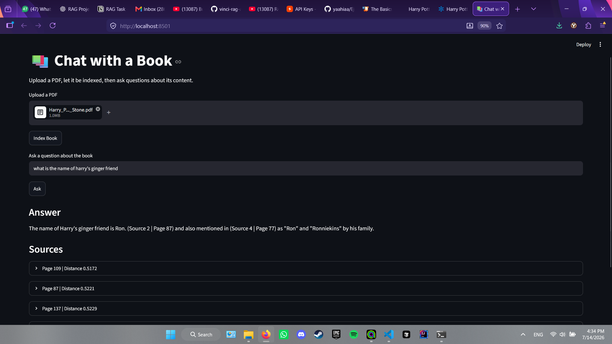
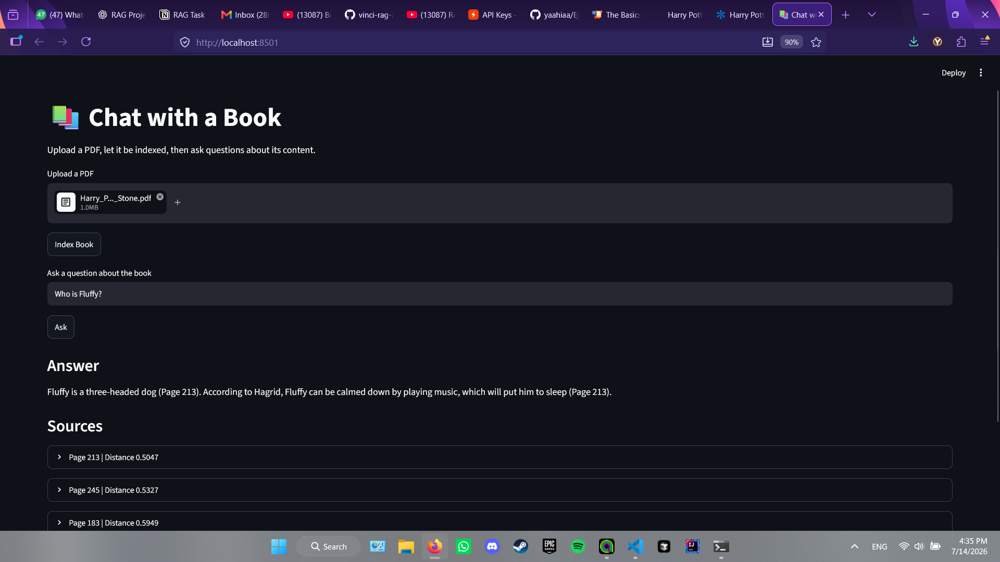

# 📚 Chat with a Book

A simple Retrieval-Augmented Generation (RAG) application that allows users to upload a PDF book, ask questions about its content, and receive answers grounded in the uploaded document.

The project implements the RAG pipeline from scratch without using LangChain.

---

## Features

- Upload a PDF book
- Extract and index the book's text
- Semantic search using vector embeddings
- Answer questions using the retrieved context
- Display supporting page references and source passages

---

## Tech Stack

- Python
- Streamlit
- PyMuPDF
- Sentence Transformers
- ChromaDB
- Groq API

---

## Project Structure

```text
.
├── app.py          # Streamlit interface
├── ingest.py       # PDF extraction, chunking and indexing
├── rag.py          # Retrieval and answer generation
├── books/
├── chroma_db/
├── .env
└── README.md
```

---

## How It Works

1. Upload a PDF book.
2. Extract the text while preserving page information.
3. Split the text into overlapping chunks.
4. Generate embeddings using Sentence Transformers.
5. Store the chunks and embeddings in ChromaDB.
6. Embed the user's question.
7. Retrieve the most relevant chunks from ChromaDB.
8. Send the retrieved context and question to Groq.
9. Return a grounded answer with supporting page references.

---

## Installation

Clone the repository:

```bash
git clone <repository-url>
cd <repository-folder>
```

Install the project dependencies:

```bash
uv sync
```

Create a `.env` file in the project root:

```env
GROQ_API_KEY=your_groq_api_key
```

Run the application:

```bash
uv run streamlit run app.py
```

The application will be available at:

```
http://localhost:8501
```

---

## Core Functions

### `extract_text(file_path)`

Extracts text from the uploaded PDF while preserving page numbers. Returns a list of page objects containing the page number and its corresponding text.

### `chunk_text(pages, chunk_size, overlap)`

Splits each page into overlapping text chunks while maintaining page metadata. This prepares the document for embedding and retrieval.

### `index_pdf(file_path)`

Processes a PDF by extracting text, creating chunks, generating embeddings, and storing them in ChromaDB along with the associated metadata.

### `retrieve_chunks(question, top_k)`

Embeds the user's question, performs a semantic similarity search in ChromaDB, and retrieves the most relevant document chunks.

### `generate_answer(question, retrieved_chunks)`

Builds a prompt using the retrieved context and sends it to the Groq LLM to generate a grounded answer with page references.

### `ask_book(question, top_k)`

High-level function that combines retrieval and answer generation, returning both the generated response and the supporting source chunks.

## Project in Action








---
